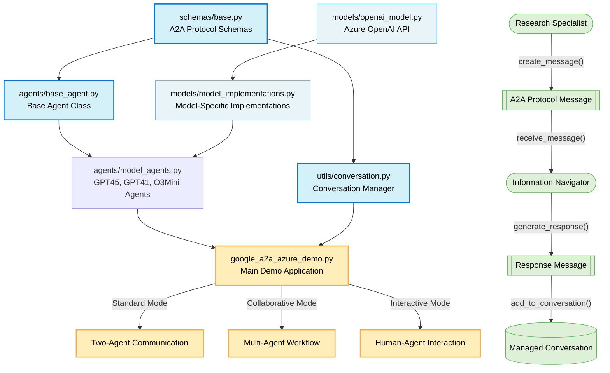

# Agent-to-Agent (A2A) Protocol Demo

This project demonstrates an implementation of the Google Agent-to-Agent (A2A) protocol using Azure OpenAI models GPT-4.5 and GPT-O3 Mini.

## Overview

The Agent-to-Agent (A2A) protocol is a standardized communication protocol defined by Google that enables autonomous AI agents to communicate, coordinate, and collaborate effectively. This demo showcases how different AI models can interact in a structured way using this protocol, leveraging Azure OpenAI services for the underlying intelligence.

The implementation provides multiple demo modes to demonstrate different aspects of agent communication and collaboration:
- **Standard Mode**: Basic agent-to-agent communication
- **Collaborative Mode**: Multiple specialized agents working together on complex tasks
- **Interactive Mode**: Human-in-the-loop interaction with A2A-compatible agents

## Architecture



## Features

- **A2A Protocol Implementation**
  - Core protocol components with standardized schemas
  - Structured message format with support for multiple content types (text, data, file)
  - Task management with state transitions (submitted, working, completed, etc.)
  - A2A-compliant agent cards and skill definitions

- **Azure OpenAI Integration**
  - Seamless integration with Azure OpenAI Services
  - Support for multiple Azure models: GPT-4.5, GPT-4.1, and GPT-O3 Mini
  - Configurable model parameters and deployment options
  - Secure API key management via environment variables

- **Demonstration Capabilities**
  - Three demo modes: Standard, Collaborative, and Interactive
  - Multi-agent conversations with coordinated workflows
  - Function calling between agents for enhanced capabilities
  - Human-in-the-loop interaction in Interactive mode

- **Developer Experience**
  - Rich terminal visualization of agent interactions
  - Extensive logging for debugging and analysis
  - Clear separation of protocol and implementation layers
  - Practical code examples for educational purposes

## Project Structure

```
├── agents/                  # Agent implementations
│   ├── base_agent.py        # Base agent class implementing A2A protocol
│   └── model_agents.py      # Model-specific agent implementations
├── models/                  # Model wrappers
│   ├── openai_model.py      # Base Azure OpenAI model wrapper
│   └── model_implementations.py  # Specific model implementations
├── schemas/                 # A2A protocol schemas
│   └── base.py              # Core schema definitions
├── utils/                   # Utility functions
│   └── conversation.py      # Conversation management
├── google_a2a_azure_demo.py # Google A2A protocol demo with Azure OpenAI
├── server.py                # Simple A2A protocol server implementation
├── requirements.txt         # Project dependencies
└── .env                     # Environment variables (API keys)
```

## Setup

1. Make sure you have Python 3.8+ installed
2. Install the required dependencies:

```bash
pip install -r requirements.txt
```

3. Configure your `.env` file in the project root directory with your Azure OpenAI API keys:

```
# Azure OpenAI GPT 4.5 Configuration
AZURE_OPENAI_ENDPOINT_GPT45="https://your-resource-name.openai.azure.com"
AZURE_OPENAI_KEY_GPT45="your-api-key-here"
AZURE_OPENAI_MODEL_GPT45="gpt-4.5-preview"
AZURE_OPENAI_DEPLOYMENT_GPT45="gpt-4.5-preview"
AZURE_OPENAI_API_VERSION="2025-03-01-preview"

# Azure OpenAI GPT-O3 Mini Configuration
AZURE_OPENAI_ENDPOINT_O3_MINI="https://your-resource-name.openai.azure.com"
AZURE_OPENAI_KEY_O3_MINI="your-api-key-here"
AZURE_OPENAI_MODEL_O3_MINI="gpt-o3-mini"
AZURE_OPENAI_DEPLOYMENT_O3_MINI="gpt-o3-mini"

# Azure OpenAI GPT-4.1 Configuration (optional for collaborative mode)
AZURE_OPENAI_ENDPOINT_GPT41="https://your-resource-name.openai.azure.com"
AZURE_OPENAI_KEY_GPT41="your-api-key-here"
AZURE_OPENAI_MODEL_GPT41="gpt-4.1-preview"
AZURE_OPENAI_DEPLOYMENT_GPT41="gpt-4.1-preview"

# Logging Configuration (optional)
LOG_LEVEL="INFO"  # Options: DEBUG, INFO, WARNING, ERROR, CRITICAL
LOG_FORMAT="%(asctime)s - %(name)s - %(levelname)s - %(message)s"
```

> **Note:** You can obtain these values from the Azure Portal under your Azure OpenAI resource. Make sure you have deployed the appropriate models in your Azure OpenAI resource.

## Running the Demos

### Google A2A Azure Demo

This is the primary demo showcasing the Google A2A protocol implementation with Azure OpenAI models. It supports three different modes:

```bash
# Standard mode - demonstrates basic agent communication
python google_a2a_azure_demo.py --mode standard

# Collaborative mode - demonstrates multi-agent collaboration
python google_a2a_azure_demo.py --mode collaborative

# Interactive mode - allows user interaction with agents
python google_a2a_azure_demo.py --mode interactive
```

## Demo Modes Explained

### Standard Mode
Demonstrates the core A2A protocol concepts between two agents (Research Specialist and Information Navigator). The agents exchange messages with both text and structured data parts, showcasing how different content types can be combined in A2A messages.

### Collaborative Mode
Shows three specialized agents (Research Specialist, Planning Strategist, Implementation Expert) working together on a complex problem. This demonstrates how the A2A protocol enables multi-agent collaboration by providing a standardized way for agents with different capabilities to build on each other's work.

### Interactive Mode
Places the user in the conversation loop with A2A-compatible agents. This demonstrates how humans can interact with A2A agents, including special commands for requesting deeper analysis or multi-modal responses.

## Azure OpenAI Integration

This implementation specifically integrates with Azure OpenAI services to provide:

- Secure access to powerful AI models hosted in Azure
- Regional availability and data residency compliance
- Enterprise-grade reliability and scalability
- Support for multiple Azure OpenAI models (GPT-4.5, GPT-4.1, GPT-O3 Mini)

## A2A Protocol Components

The implementation includes the following key A2A protocol components:

1. **Message Format**: Standardized message structure with IDs, sender/recipient information, and content
2. **Agent Specifications**: Clear definition of agent capabilities and supported protocols
3. **Content Types**: Support for different types of content (text, data, file)
4. **Task Management**: Task creation, status updates, and artifact generation
5. **Conversation Sessions**: Manage and track conversations between multiple agents
6. **Function Calling**: Ability for agents to invoke functions and process results

## Comparison with Official Google A2A Protocol

This implementation is a practical adaptation of the official [Google A2A Protocol](https://github.com/google/A2A). Here's how our implementation compares:

### Similarities

- **Core Concept**: Both focus on enabling different AI agents to communicate and collaborate
- **Message Structure**: Both use standardized message formats with sender/recipient information
- **Task States**: Both implement the task states defined in the A2A protocol (`submitted`, `working`, `input-required`, `completed`, `failed`, `canceled`)
- **Content Types**: Both support multiple content types (text, data, file)
- **Function Calling**: Both support capability sharing through function calls

### Key Differences

1. **Implementation Approach**: Our implementation uses a hybrid approach with both in-process Python objects and HTTP endpoints, while the official protocol specifies a pure HTTP-based approach
2. **Azure Integration**: Our implementation is specifically designed to work with Azure OpenAI models
3. **Demo Focus**: Our implementation includes multiple demo modes to showcase different aspects of agent communication
4. **Agent Discovery**: The official A2A emphasizes agent discovery through well-known endpoints, while our implementation focuses more on direct communication
5. **Standard Specification**: Our implementation balances practical demonstrations with protocol adherence

## Comparison with Model Context Protocol (MCP)

While both A2A and MCP are designed to standardize AI interactions, they serve different purposes and operate at different levels:

### Key Differences from MCP

1. **Scope and Purpose**:
   - **A2A**: Focuses on agent-to-agent communication and collaboration, enabling independent AI agents to work together on tasks
   - **MCP**: Acts as a "USB-C port for AI applications" - standardizing how applications provide context to LLMs and connect them to different data sources and tools

2. **Architecture Level**:
   - **A2A**: Higher-level protocol for orchestrating multiple autonomous agents in a collaborative workflow
   - **MCP**: Client-server architecture focused on standardizing context exchange between applications and language models

3. **Communication Pattern**:
   - **A2A**: Multi-directional communication (agent-to-agent, agent-to-user, agent-to-system) with emphasis on message exchange
   - **MCP**: Primarily connects host applications (clients) to data sources and tools (servers) to provide context to LLMs

4. **Component Focus**:
   - **A2A**: Emphasizes agent capabilities, skills, conversation sessions, tasks, and artifacts
   - **MCP**: Emphasizes resources (exposing data/content), tools (performing actions), and prompts (reusable templates)

5. **Implementation Complexity**:
   - **A2A**: More complex with multi-agent orchestration, skill discovery, and task management
   - **MCP**: Focused on creating standardized connections to data sources and tools for LLM context

### When to Use Each Protocol

- **Use A2A when**: You need multiple specialized agents to collaborate on complex tasks, requiring orchestration of different capabilities and asynchronous workflows
  
- **Use MCP when**: You need to standardize how your application connects LLMs to various data sources, tools, and context providers

### Potential for Integration

A complementary approach might integrate both protocols:
- Use **MCP** for providing context and tools to individual agents (standardizing the data/tool connections)
- Use **A2A** for orchestrating collaboration between multiple agents (standardizing agent communication)

This implementation demonstrates how A2A can be used as a higher-level protocol for agent coordination, while MCP-like patterns could be implemented within each agent to standardize how they access external data and tools.

## Extending the Demo

You can extend this demo by:

- Adding more agent types with different capabilities
- Implementing more complex function calling scenarios
- Creating a web interface for visualization
- Adding support for more content types (images, audio, etc.)
- Implementing A2A protocol extensions
- Integrating with Azure services like Azure AI Search or Azure Cognitive Services

## Resources

- [Google Agent-to-Agent Protocol](https://github.com/google/A2A)
- [Google A2A Documentation](https://google.github.io/A2A/)
- [Azure OpenAI Documentation](https://learn.microsoft.com/en-us/azure/ai-services/openai/)
- [Azure OpenAI API Reference](https://learn.microsoft.com/en-us/azure/ai-services/openai/reference)

## License

MIT

## Disclaimer

This project is intended for educational purposes only. It demonstrates a simplified and more practical implementation of the Google Agent-to-Agent protocol using the latest Azure OpenAI models. This implementation is not affiliated with or endorsed by Google, and it may deviate from the official protocol specification in certain aspects to prioritize practical demonstrations and ease of understanding. The code showcases how the protocol can be adapted and implemented in real-world scenarios with Azure OpenAI services.

While efforts have been made to adhere to the core principles of the A2A protocol, this project focuses on practical applications rather than complete specification compliance. Users interested in the official protocol should refer to the [Google A2A Repository](https://github.com/google/A2A) and [documentation](https://google.github.io/A2A/).